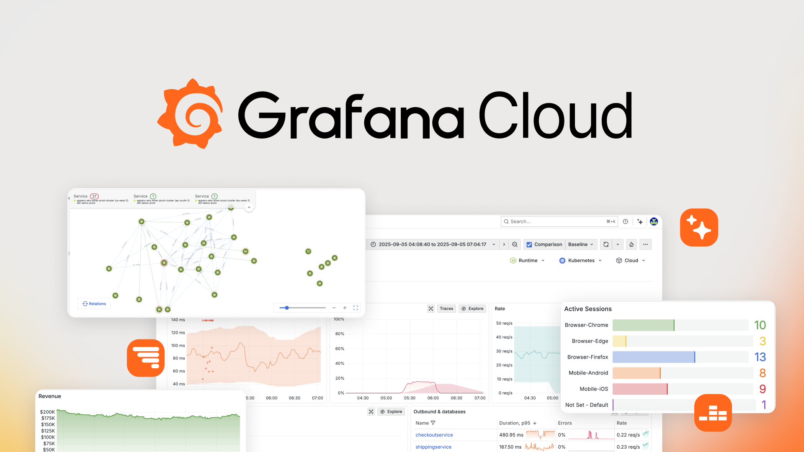

## Czym jest Grafana?

Grafana to open-source'owa platforma do monitorowania i wizualizacji danych, która umożliwia agregację, analizę i prezentację metryk z różnorodnych źródeł danych w formie interaktywnych dashboardów. Zaprojektowana została z myślą o obserwability stack'u, łącząc metryki, logi i tracing w jednym miejscu.

**1. Wizualizacja danych z wielu źródeł**
Grafana działa jako warstwa wizualizacyjna dla różnych systemów przechowywania danych. Natywnie obsługuje ponad 80 źródeł danych, w tym:
- Bazy metryk: Prometheus, InfluxDB, Graphite
- Bazy relacyjne: MySQL, PostgreSQL, Microsoft SQL Server
- Systemy wyszukiwania: Elasticsearch, OpenSearch
- Systemy logów: Loki
- Platformy chmurowe: CloudWatch, Azure Monitor, Google Cloud Monitoring

**2. Interaktywne dashboardy**
- Tworzenie dashboardów z wieloma panelami wizualizacyjnymi
- Bogata biblioteka typów wizualizacji: wykresy liniowe, słupkowe, gauges, mapy cieplne, tabele, histogramy
- System zmiennych i templating umożliwiający dynamiczne dashboardy
- Organizacja w foldery i playlisty
- Import/export dashboardów w formacie JSON

**3. System alertowania (Alerting)**
- Definiowanie alert rules bezpośrednio w kontekście dashboardów
- Wielokanałowe powiadomienia (email, Slack, PagerDuty, webhook, OpsGenie)
- Contact points i notification policies z routingiem
- Grupowanie, deduplikacja i wyciszanie alertów (silences)
- Alertmanager integration dla Prometheus alerts

**4. Eksploracja danych**
- Explore mode do ad-hoc analiz i troubleshootingu
- Query builder dla źródeł danych
- Korelacja między metrykami i logami
- Przeglądanie tracingów (z Tempo)

**5. Zarządzanie użytkownikami i uprawnieniami**
- Organizacje (organizations) i zespoły (teams)
- Role-based access control (RBAC) – w zależności od wersji
- Kontrola dostępu do dashboardów i folderów
- Uwierzytelnianie: lokalne konta, OAuth, LDAP, SAML

**6. Provisioning i automatyzacja**
- Provisioning datasources, dashboardów i alertów poprzez pliki YAML
- REST API do zarządzania zasobami
- Podejście Infrastructure as Code (IaC)
- Integracja z CI/CD

**7. Pluginy i rozszerzalność**
- Panel plugins (nowe typy wizualizacji)
- Data source plugins (wsparcie dla dodatkowych źródeł danych)
- App plugins (kompletne aplikacje w Grafanie)

---

## Grafana Enterprise – rozszerzenia względem OSS

Grafana Enterprise to komercyjna wersja Grafany oferująca dodatkowe funkcje korporacyjne, których **nie znajdziemy w wersji OSS**:

### Kluczowe różnice względem OSS

**1. Zaawansowany RBAC (Role-Based Access Control)**
- Granularna kontrola dostępu na poziomie datasources, dashboardów, folderów
- Tworzenie custom roles z precyzyjnymi uprawnieniami
- Dziedziczenie uprawnień w hierarchii organizacji
- Data source permissions (ograniczenie dostępu do wrażliwych źródeł danych)

**2. Enterprise data sources**
Oficjalnie wspierane pluginy dla komercyjnych systemów:
- Splunk
- Datadog
- New Relic
- AppDynamics
- Dynatrace
- Oracle Database
- SAP HANA
- MongoDB Enterprise
- Snowflake
- ServiceNow

**3. Enhanced authentication**
- SAML authentication z mapowaniem ról
- Enhanced LDAP z synchronizacją grup i automatycznym provisioningiem
- Team sync z Identity Providers (Okta, Azure AD, OneLogin)

**4. Audit logs**
- Szczegółowe logowanie wszystkich działań użytkowników
- Historia zmian w dashboardach i datasources
- Compliance z regulacjami (GDPR, HIPAA, SOC 2)

**5. Reporting**
- Automatyczne generowanie raportów PDF z dashboardów
- Scheduler do planowania raportów (daily, weekly, monthly)
- Dystrybucja przez email
- Customizacja brandingu i formatowania

**6. Zaawansowane funkcje administracyjne**
- Query caching (przyspieszenie działania dashboardów, redukcja obciążenia datasources)
- White labeling (własne logo, branding, kolorystyka)
- Usage insights (analityka wykorzystania Grafany w organizacji)
- Vault integration (HashiCorp Vault dla bezpiecznego przechowywania credentials)

**7. Dedykowane wsparcie techniczne**
- Support plans: Standard (8x5), Premium (24x7), Enterprise (z dedykowanym TAM)
- Gwarantowane SLA
- Konsultacje architektoniczne
- Pomoc w optymalizacji wydajności

---

## Grafana Cloud – zarządzana platforma SaaS

Grafana Cloud to w pełni zarządzane rozwiązanie w modelu Software-as-a-Service, które **eliminuje potrzebę zarządzania infrastrukturą** i oferuje dodatkowe usługi, których **nie ma w samodzielnie hostowanej Grafanie OSS**:

### Kluczowe różnice względem OSS

**1. Zero operational overhead**
- Brak potrzeby instalacji, konfiguracji, aktualizacji i utrzymania serwerów
- Automatyczne skalowanie infrastruktury
- Wysoka dostępność (SLA 99.9%)
- Automatyczne backupy i disaster recovery

**2. Zintegrowany observability stack**

**Prometheus-as-a-Service (Grafana Mimir)**
- Długoterminowe przechowywanie metryk Prometheus
- Automatyczny sharding i skalowanie
- Brak limitów liczby metryk (w wyższych planach)
- Kompatybilność z ekosystemem Prometheus

**Loki-as-a-Service**
- Zarządzane przechowywanie i indeksowanie logów
- Integracja z metrykami (korelacja)
- Wydajne wyszukiwanie w dużych wolumenach logów

**Tempo-as-a-Service**
- Distributed tracing dla aplikacji
- Korelacja tracingów z metrykami i logami
- Integracja z OpenTelemetry

**Grafana OnCall**
- Zaawansowane zarządzanie incydentami
- Eskalacja alertów i harmonogramy dyżurów (on-call schedules)
- Integracja z popularnymi narzędziami ticketingowymi

**3. Synthetic Monitoring**
- Monitorowanie dostępności aplikacji z różnych lokalizacji geograficznych
- Testy HTTP/HTTPS, DNS, TCP, ping
- Proaktywne wykrywanie niedostępności

**4. Predefiniowane dashboardy i integracje**
- Biblioteka gotowych dashboardów dla popularnych technologii
- One-click integrations (Kubernetes, Docker, AWS, Azure, GCP)
- Automatyczne wykrywanie i konfiguracja datasources

**5. Funkcje Enterprise w planach Cloud**
W ramach wyższych planów Grafana Cloud zawiera wybrane funkcje Enterprise:
- RBAC (Role-Based Access Control)
- Audit logs
- SAML/SSO
- Reporting (PDF reports)
- Zaawansowane zarządzanie zespołami

**6. Globalna dystrybucja**
- Multiple regions (US, EU, APAC)
- Edge locations dla niskich latencji

**7. Plan darmowy (Free Tier)**
- 10,000 series metryk miesięcznie
- 50 GB logów miesięcznie
- 50 GB traces miesięcznie
- 3 aktywnych użytkowników
- Idealne do małych projektów i testowania

---

## Porównanie: Grafana OSS vs Cloud vs Enterprise

| **Funkcjonalność**                                                       |     **OSS**      |       **Cloud**       |      **Enterprise**       |
| ------------------------------------------------------------------------ | :--------------: | :-------------------: | :-----------------------: |
| **Model wdrożenia**                                                      |   Self-hosted    |   SaaS (zarządzane)   |        Self-hosted        |
| **Koszt bazowy**                                                         |     Darmowa      |  Free tier / Płatne   |    Licencja komercyjna    |
| **Zarządzanie infrastrukturą**                                           |    Użytkownik    |     Grafana Labs      |        Użytkownik         |
| **Automatyczne skalowanie**                                              |       Nie        |          Tak          |  Nie (wymaga planowania)  |
| **SLA uptime**                                                           |       Nie        |       Tak 99.9%       | Zależne od infrastruktury |
|                                                                          |                  |                       |                           |
| **PODSTAWOWE FUNKCJE**                                                   |                  |                       |                           |
| Datasources (Prometheus, InfluxDB, MySQL, PostgreSQL, Elasticsearch)     |       Tak        |          Tak          |            Tak            |
| Dashboardy i wizualizacje                                                |       Tak        |          Tak          |            Tak            |
| Alerting (Alert Rules)                                                   |       Tak        |          Tak          |            Tak            |
| Contact Points (email, Slack, webhook)                                   |       Tak        |          Tak          |            Tak            |
| Explore mode                                                             |       Tak        |          Tak          |            Tak            |
| Foldery i playlisty                                                      |       Tak        |          Tak          |            Tak            |
| Import/export dashboardów                                                |       Tak        |          Tak          |            Tak            |
| Provisioning (YAML)                                                      |       Tak        |          Tak          |            Tak            |
| REST API                                                                 |       Tak        |          Tak          |            Tak            |
| Pluginy (community)                                                      |       Tak        |          Tak          |            Tak            |
|                                                                          |                  |                       |                           |
| **UWIERZYTELNIANIE**                                                     |                  |                       |                           |
| Lokalne konta                                                            |       Tak        |          Tak          |            Tak            |
| OAuth (Google, GitHub, Azure AD)                                         |       Tak        |          Tak          |            Tak            |
| LDAP                                                                     | Tak (podstawowe) |          Tak          |      Tak (enhanced)       |
| SAML / SSO                                                               |       Nie        |  Tak (wyższe plany)   |            Tak            |
| Team sync (IdP)                                                          |       Nie        |  Tak (wyższe plany)   |            Tak            |
|                                                                          |                  |                       |                           |
| **RBAC I BEZPIECZEŃSTWO**                                                |                  |                       |                           |
| Podstawowe role (Admin, Editor, Viewer)                                  |       Tak        |          Tak          |            Tak            |
| Organizacje (Orgs) i Teams                                               |       Tak        |          Tak          |            Tak            |
| Folder permissions                                                       | Tak (podstawowe) |          Tak          |    Tak (zaawansowane)     |
| Advanced RBAC (custom roles, granular permissions)                       |       Nie        |  Tak (wyższe plany)   |            Tak            |
| Data source permissions                                                  |       Nie        |  Tak (wyższe plany)   |            Tak            |
| Audit logs                                                               |       Nie        |  Tak (wyższe plany)   |            Tak            |
|                                                                          |                  |                       |                           |
| **DATASOURCES**                                                          |                  |                       |                           |
| Enterprise data sources (Splunk, Datadog, Oracle, Snowflake, ServiceNow) |       Nie        |       Częściowo       |            Tak            |
|                                                                          |                  |                       |                           |
| **OBSERVABILITY STACK**                                                  |                  |                       |                           |
| Prometheus hosting                                                       |   Nie (własny)   |  Tak (Mimir managed)  |       Nie (własny)        |
| Loki hosting                                                             |   Nie (własny)   |     Tak (managed)     |       Nie (własny)        |
| Tempo hosting (tracing)                                                  |   Nie (własny)   |     Tak (managed)     |       Nie (własny)        |
| Synthetic Monitoring                                                     |       Nie        |          Tak          |            Nie            |
| Grafana OnCall (incident management)                                     |       Nie        |          Tak          |            Nie            |
|                                                                          |                  |                       |                           |
| **RAPORTOWANIE I ADMINISTRACJA**                                         |                  |                       |                           |
| PDF Reports (scheduled)                                                  |       Nie        |  Tak (wyższe plany)   |            Tak            |
| Query caching                                                            |       Nie        |       Wbudowane       |            Tak            |
| White labeling (branding)                                                |       Nie        |          Nie          |            Tak            |
| Usage insights                                                           |       Nie        |  Tak (wyższe plany)   |            Tak            |
| Vault integration                                                        |       Nie        |          Nie          |            Tak            |
|                                                                          |                  |                       |                           |
| **WSPARCIE TECHNICZNE**                                                  |                  |                       |                           |
| Dokumentacja                                                             |       Tak        |          Tak          |            Tak            |
| Community support (forum, GitHub)                                        |       Tak        |          Tak          |            Tak            |
| Gwarantowany SLA                                                         |       Nie        |  Tak (płatne plany)   |            Tak            |
| 24x7 Support                                                             |       Nie        |  Tak (premium plans)  |            Tak            |
| Technical Account Manager (TAM)                                          |       Nie        | Tak (enterprise plan) |            Tak            |
| Konsultacje architektoniczne                                             |       Nie        | Tak (enterprise plan) |            Tak            |

---

## Kiedy wybrać którą wersję?

### Wybierz **Grafana OSS** jeśli:

- Masz dedykowany zespół DevOps/SRE do zarządzania infrastrukturą  
- Chcesz pełnej kontroli nad środowiskiem i danymi  
- Masz ograniczony budżet na oprogramowanie monitorujące  
- Potrzebujesz customowych rozszerzeń i modyfikacji  
- Dane muszą pozostać lokalnie (on-premise, compliance)  
- Korzystasz tylko z open-source'owych datasources  
- Nie potrzebujesz zaawansowanego RBAC ani audit logs

**Typowe scenariusze:**
- Małe i średnie zespoły z własnymi zasobami IT
- Projekty developerskie wymagające elastyczności
- Środowiska testowe i laboratoria
- Startupy z ograniczonym budżetem

---

### Wybierz **Grafana Cloud** jeśli:

- Chcesz szybkiego wdrożenia bez zarządzania infrastrukturą  
- Potrzebujesz zintegrowanego stacku (metryki + logi + tracing)  
- Dynamicznie skalujesz infrastrukturę  
- Preferujesz model OPEX zamiast CAPEX  
- Używasz aplikacji cloud-native  
- Nie masz dedykowanego zespołu do utrzymania platformy monitorującej  
- Potrzebujesz synthetic monitoring lub Grafana OnCall

**Typowe scenariusze:**
- Startupy i scale-upy rosnące dynamicznie
- Organizacje bez dedykowanych zespołów SRE/DevOps
- Monitoring aplikacji SaaS w chmurze publicznej
- Środowiska z wieloma mikrousługami wymagającymi tracingu
- Projekty wymagające korelacji metryk, logów i tracingów

---

### Wybierz **Grafana Enterprise** jeśli:

- Potrzebujesz zaawansowanego RBAC i granularnych uprawnień  
- Używasz komercyjnych datasources (Splunk, Oracle, Datadog, ServiceNow)  
- Masz wymagania compliance (HIPAA, SOC 2, GDPR) wymagające audit logs  
- Potrzebujesz gwarantowanego wsparcia technicznego z SLA  
- Zarządzasz setkami lub tysiącami użytkowników  
- Wymagane jest scheduled PDF reporting  
- Projekty mission-critical wymagające dedykowanego supportu

**Typowe scenariusze:**
- Duże przedsiębiorstwa z tysiącami użytkowników
- Bankowość i finanse (wymogi compliance)
- Healthcare (HIPAA, wrażliwe dane medyczne)
- Organizacje z wieloma zespołami i złożonymi strukturami uprawnień
- Integracja z enterprise-grade systemami monitorującymi

---

## Migracja między wersjami

### OSS → Cloud
1. Export dashboardów z OSS (JSON)
2. Utworzenie konta Grafana Cloud
3. Import dashboardów
4. Migracja agentów zbierających metryki/logi do Cloud endpoints
5. Przekierowanie alertów

**Czas:** 1-7 dni (zależnie od skali)

### OSS → Enterprise
1. Zakup licencji Enterprise
2. Update binariów Grafany (kompatybilność wsteczna)
3. Konfiguracja funkcji Enterprise (RBAC, SAML, audit logs)
4. Szkolenie zespołu

**Czas:** 1-14 dni

### Cloud Free → Cloud Paid
- Upgrade planu subskrypcji (self-service)
- Automatyczna aktywacja dodatkowych limitów
- Brak migracji danych

**Czas:** Natychmiastowy

---

## Podsumowanie

**Grafana OSS** to potężna, darmowa platforma idealna dla większości projektów – od małych po średnie wdrożenia. Oferuje pełną funkcjonalność monitorowania i wizualizacji bez żadnych kosztów licencyjnych.

**Grafana Cloud** eliminuje operational overhead, oferuje zintegrowany observability stack (Mimir + Loki + Tempo) i jest idealnym rozwiązaniem dla organizacji preferujących model SaaS.

**Grafana Enterprise** to wybór dla dużych przedsiębiorstw z zaawansowanymi wymaganiami bezpieczeństwa, compliance i integracją z komercyjnymi systemami klasy enterprise.

Wybór wersji powinien być podyktowany wielkością organizacji, wymaganiami compliance, budżetem oraz dostępnością zespołu do zarządzania infrastrukturą.

