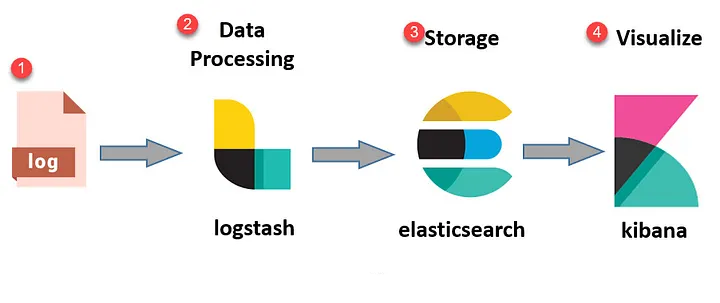

## Czym jest Elasticsearch

Elasticsearch to rozproszony silnik wyszukiwania i analityki, zbudowany na bibliotece Apache Lucene. Jest częścią stosu Elastic Stack (dawniej ELK Stack: Elasticsearch, Logstash, Kibana), zaprojektowanego do przechowywania, indeksowania, wyszukiwania i analizowania dużych wolumenów danych w czasie rzeczywistym.

### Kluczowe cechy

- **Architektura rozproszona**: Clustering, sharding i replikacja zapewniają skalowalność poziomą i wysoką dostępność.
- **Near real-time search**: Dane są indeksowane i dostępne do przeszukiwania w czasie zbliżonym do rzeczywistego (odświeżanie indeksów co ~1 sekundę).
- **RESTful API**: Wszystkie operacje (CRUD, wyszukiwanie, administracja) wykonywane są przez HTTP/JSON.
- **Query DSL**: Zaawansowany język zapytań oparty na JSON, umożliwiający złożone wyszukiwania, filtrowanie i agregacje.
- **Schema-free (dynamic mapping)**: Automatyczne wykrywanie typów pól z możliwością definiowania własnych mappings.
- **Aggregations**: Potężny framework do budowania analiz, statystyk, histogramów i grupowania danych.

### Model danych

Elasticsearch wykorzystuje model dokumentowy, gdzie dane przechowywane są w formacie JSON. Każdy dokument jest indeksowany i może być szybko wyszukany według różnych kryteriów.

**Podstawowe koncepcje:**
- **Index**: Logiczny kontener dla dokumentów (analogia do bazy danych).
- **Document**: Pojedyncza jednostka danych w formacie JSON.
- **Field**: Pole w dokumencie (analogia do kolumny w bazie danych).
- **Shard**: Fragment indeksu umożliwiający rozproszenie danych.
- **Replica**: Kopia shardu zapewniająca wysoką dostępność.

### Zastosowania

Elasticsearch stosowany jest w wielu scenariuszach:
- Wyszukiwarki aplikacyjne (full-text search).
- Analiza logów i SIEM (Security Information and Event Management).
- Monitoring wydajności aplikacji (APM - Application Performance Monitoring).
- Business intelligence i analiza metryk biznesowych.
- Analiza zachowań użytkowników.



### Rola w połączeniu z Grafaną

W architekturze opartej o Grafanę, Elasticsearch pełni najczęściej funkcję repozytorium logów i zdarzeń aplikacyjnych. Typowy scenariusz to ELK/EFK Stack, gdzie logi są zbierane przez Logstash/Fluentd/Filebeat, indeksowane w Elasticsearch i wizualizowane w Kibanie lub Grafanie.

**Typowy przepływ danych:**

```
Aplikacje/Serwery → Filebeat/Logstash → Elasticsearch → Grafana
                                              ↓
                                           Kibana
```

**Różnica względem Loki:**

| Właściwość | Elasticsearch | Loki |
|-----------|---------------|------|
| **Indeksowanie** | Pełne indeksowanie treści logów | Tylko labels (metadata) |
| **Wyszukiwanie** | Full-text search, regex, fuzzy | Grep-like queries |
| **Zasoby** | Większe wymagania | Niższe koszty storage |
| **Optymalizacja** | Złożone agregacje i analityka | Stream-based log queries |

## Kluczowe korzyści ze stosowania Elasticsearch

| Aspekt | Korzyść |
|--------|---------|
| **Wyszukiwanie** | Full-text search, regex, fuzzy matching – niedostępne w TSDB jak Prometheus/InfluxDB |
| **Skalowalność** | Clustering, sharding, replikacja – skalowanie horyzontalne do petabajtów danych |
| **Agregacje** | Zaawansowane aggregations (bucketing, metrics, pipeline) dla analiz biznesowych |
| **Ekosystem** | Elastic Stack (Kibana, Beats, Logstash, APM) – kompletne rozwiązanie observability |
| **Korelacja danych** | Grafana łączy Elasticsearch (logi/APM) z Prometheus (metryki) w jednym dashboardzie |
| **Wizualizacja** | Grafana oferuje bardziej elastyczne dashboardy niż Kibana dla multi-source correlation |

### Typowe decyzje projektowe

1. **Index strategy**: Time-based indices (daily, weekly, monthly) vs single index – wpływ na retention i performance
2. **Shard sizing**: 1 shard = 10–50 GB (guideline), zbyt dużo małych shards degraduje wydajność klastra
3. **Replicas**: Minimum 1 replica dla HA, więcej dla read-heavy workloads
4. **ILM (Index Lifecycle Management)**: Automatyzacja rollover, shrink, delete (hot-warm-cold-delete tiers)
5. **Mapping design**: Explicit mappings vs dynamic – kontrola typów, analyzers, keyword vs text fields
6. **Security**: Włączenie Elastic Security (authentication, TLS, RBAC) – konieczne w prod
7. **Monitoring Elasticsearch**: Monitorowanie samego klastra (cluster health, JVM, disk, query performance) w Grafanie lub Kibana Monitoring

### Typowe pułapki produkcyjne

- **Brak ILM**: Niekontrolowany wzrost indeksów, przepełnienie dysków, degradacja wydajności
- **Zbyt wiele małych shardów**: Overhead zarządzania, cluster state bloat, powolne zapytania
- **Nieodpowiednie mappings**: Błędne typy pól (np. IP jako text zamiast ip), brak keyword fields dla agregacji
- **Split brain**: Niewłaściwa konfiguracja `discovery.zen.minimum_master_nodes` w starszych wersjach (< 7.x)
- **JVM heap tuning**: Domyślne 1 GB niewystarczające, zalecane 50% RAM (max 31 GB z powodu Compressed OOPs)
- **Brak monitoringu klastra**: Cluster health, node failures, slow queries – monitoring infrastruktury Elasticsearch jest krytyczny
- **Bezpieczeństwo**: Exposing Elasticsearch bez authentication/TLS – podatność na ataki
- **Cardinality explosion w aggregations**: Zbyt duże aggregations (miliony buckets) mogą wyczerpać heap

