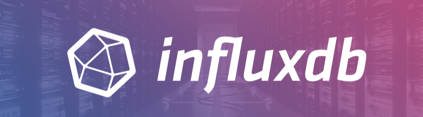

## InfluxDB w ekosystemie Grafany – rola, funkcje, integracja



### Czym jest InfluxDB?

InfluxDB to otwartoźródłowa baza danych szeregów czasowych (Time Series Database - TSDB), zaprojektowana specjalnie do przechowywania, przetwarzania i analizowania danych z oznaczeniem czasu. Stworzona przez InfluxData, InfluxDB jest jednym z najpopularniejszych rozwiązań do obsługi metryk, zdarzeń i analiz w czasie rzeczywistym.

**Kluczowe cechy InfluxDB:**

- **Optymalizacja pod szeregi czasowe**: Architektura zaprojektowana specjalnie dla danych timestamped, oferująca wysoką wydajność zapisu i odczytu
- **Język zapytań InfluxQL/Flux**: InfluxQL (podobny do SQL) oraz nowszy Flux umożliwiają zaawansowane przetwarzanie i agregację danych
- **Schemat dynamiczny**: Elastyczna struktura danych oparta na measurements, tags i fields
- **Retention policies**: Automatyczne zarządzanie cyklem życia danych, usuwanie starych metryk zgodnie z polityką retencji
- **Continuous queries**: Preagregacja i downsampling danych w tle dla optymalizacji zapytań
- **High write throughput**: Możliwość obsługi setek tysięcy zapisów na sekundę

InfluxDB występuje w kilku wersjach: InfluxDB OSS (open source), InfluxDB Cloud oraz InfluxDB Enterprise dla środowisk produkcyjnych wymagających wysokiej dostępności i klastrowania.

### Rola InfluxDB w połączeniu z Grafaną

InfluxDB w architekturze opartej o Grafanę pełni funkcję centralnego repozytorium metryk i danych telemetrycznych. W porównaniu do Prometheusa, który realizuje model pull (scraping), InfluxDB często pracuje w modelu push, gdzie aplikacje i agenci (np. Telegraf) aktywnie wysyłają metryki do bazy.

**Zastosowania w kontekście Grafany:**

1. **Źródło danych dla dashboardów**: Grafana posiada natywny datasource plugin dla InfluxDB, obsługujący zarówno InfluxQL jak i Flux
2. **Agregacja metryk z wielu źródeł**: InfluxDB może zbierać dane z aplikacji, infrastruktury, IoT, sensorów przemysłowych
3. **Long-term storage**: W porównaniu do lokalnego TSDB Prometheusa, InfluxDB jest często wykorzystywany jako długoterminowe repozytorium metryk
4. **Integracja z ekosystemem TICK**: Telegraf (zbieranie), InfluxDB (storage), Chronograf (wizualizacja), Kapacitor (alerting) – Grafana może zastąpić Chronograf jako warstwa wizualizacji

**Typowy przepływ danych:**

```
Aplikacje/Serwery → Telegraf → InfluxDB → Grafana → Dashboardy/Alerty
IoT/Sensory ↗
```


### Do jakich zastosowań warto używać InfluxDB z Grafaną

#### 1. **Monitoring infrastruktury IT**
- Zbieranie metryk systemowych (CPU, RAM, dysk, sieć) przez Telegraf
- Monitoring klastrów (Kubernetes, Docker, VM)
- Metryki aplikacyjne (JVM, Node.js, Python)

**Korzyści:**
- Telegraf oferuje ponad 200 gotowych pluginów input/output
- Łatwa integracja z popularnymi technologiami bez pisania custom exporterów
- Model push eliminuje potrzebę service discovery

#### 2. **IoT i monitoring środowiskowy**
- Sensory temperatury, wilgotności, ciśnienia
- Smart buildings, smart cities
- Przemysł 4.0 – monitoring linii produkcyjnych

**Korzyści:**
- Optymalizacja pod wysoką częstotliwość próbkowania
- Downsampling automatycznie redukuje objętość danych historycznych
- Obsługa milionów szeregów czasowych

#### 3. **Business analytics i KPI**
- Metryki biznesowe (transakcje, konwersje, SLA)
- Financial data, trading analytics
- Web analytics (page views, user sessions)

**Korzyści:**
- Elastyczny model danych (tags jako wymiary analityczne)
- Szybkie agregacje i matematyka na dużych zbiorach
- Integracja z BI tools przez Grafanę

#### 4. **DevOps i observability**
- Application Performance Monitoring (APM)
- Continuous queries dla preagregacji metryk deployment
- Korelacja metryk z logami (Grafana Loki) i traces (Tempo/Jaeger)

**Korzyści:**
- Retention policies automatycznie zarządzają cyklem życia danych
- Continuous queries redukują koszty storage i przyspieszają dashboardy
- Grafana umożliwia korelację różnych źródeł danych w jednym widoku

### Kluczowe korzyści ze stosowania InfluxDB z Grafaną

| Aspekt | Korzyść |
|--------|---------|
| **Wydajność** | Wysoka przepustowość zapisu (>1M points/sec), zoptymalizowane zapytania agregujące |
| **Skalowalność** | Clustering w wersji Enterprise, sharding, replikacja |
| **Integracja** | Natywny plugin Grafany, ekosystem TICK, kompatybilność z Telegraf |
| **Administracja** | Automatyczna retencja, continuous queries, brak konieczności definiowania schematu z góry |
| **Koszty** | OSS dostępne za darmo, niższe koszty storage dzięki downsampling |
| **Elastyczność** | Obsługa różnych źródeł danych (IT, IoT, business), custom tags dla wymiarów |

### Typowe decyzje projektowe

1. **InfluxDB 1.x vs 2.x**: Wersja 1.x stabilna, szeroko wspierana; 2.x oferuje Flux (potężniejszy), unified API, ale wymaga adaptacji
2. **Single node vs Enterprise Cluster**: Dla środowisk prod z wysoką dostępnością rekomendowany clustering
3. **Retention policies**: Zdefiniowanie wielopoziomowych polityk (np. 7 dni raw, 30 dni downsampled, 365 dni aggregated)
4. **Telegraf vs custom agents**: Telegraf pokrywa większość use cases, custom agenci dla specyficznych integracji
5. **InfluxQL vs Flux**: InfluxQL prostszy dla użytkowników SQL, Flux potężniejszy dla zaawansowanych transformacji

### Typowe pułapki produkcyjne

- **Brak strategii retention**: Nieograniczony wzrost bazy danych, koszty storage
- **Nadmierna cardinaliteit**: Używanie dynamicznych wartości (UUID, timestamps) jako tags prowadzi do eksplozji serii
- **Brak monitoringu samego InfluxDB**: Monitoring CPU, memory, disk I/O, query performance InfluxDB
- **Niewłaściwe tagowanie**: Tags vs fields – niepoprawny wybór utrudnia agregacje
- **Bezpieczeństwo**: Brak token authentication, ekspozycja API bez SSL/TLS

